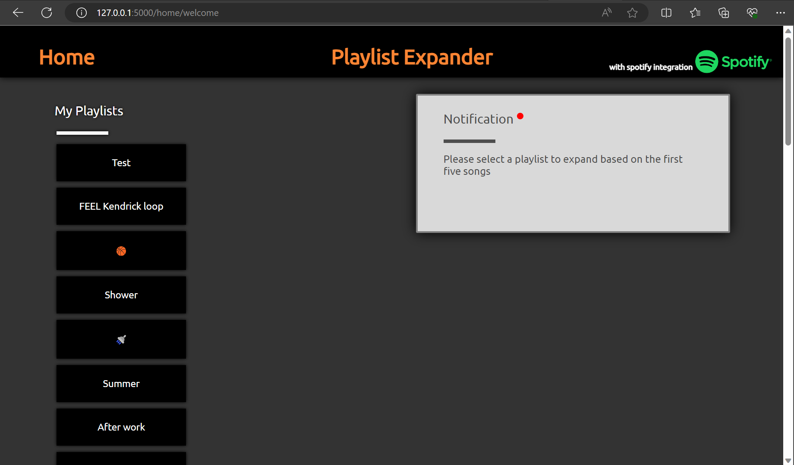
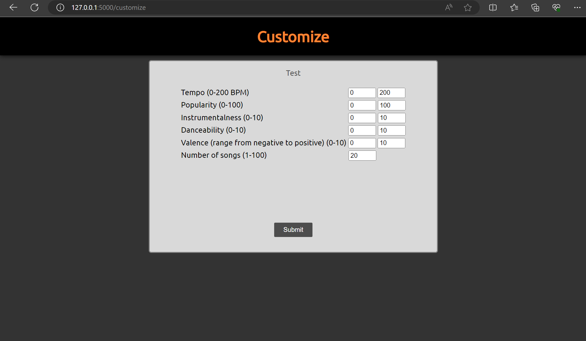
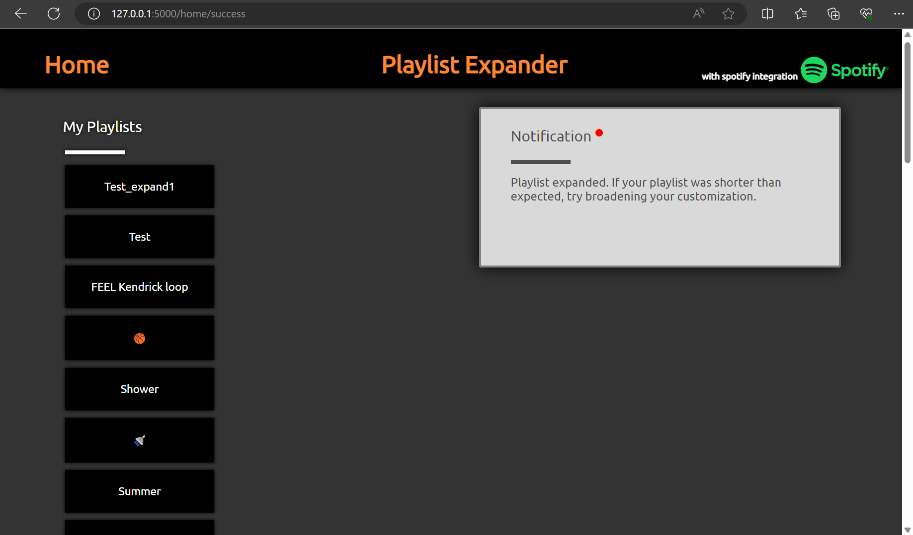
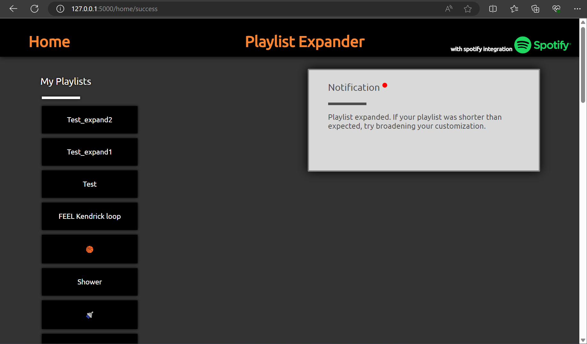

# Web-Spotify-Playlist-Expander
This is a music discovery tool. This project creates a new custom playlist based on the first five songs of a selected playlist. The playlist is generated using the spotify web api recommendations tool. The number of songs on the new playlist, tempo, popularity, instrumentalness, danceability, and valence of the songs on the playlist are customizeable.

# Home Page
Allows user to choose a playlist on their Spotify profile to "expand"

# Customization Page
Provides user with multiple customization options and specifies limits

After hitting submit "playlist name"_expand1 is created on the user's Spotify profile

Functionality to order multiple expansions of the same playlist

 # Local Setup:
-----requires spotify account-----
1. go to developer.spotify.com and create app with http://127.0.0.1:5000/redirect redirect uri to get required api client id and key used in SEapp.py (lines 245, 246)
2. create venv and install flask and spotipy, alternatively, install flask and spotipy on your system
3. navigate to directory in the terminal and run: python SEapp.py
4. open http://127.0.0.1:5000 in browser

built with:
flask 2.3.3
spotipy 2.23.0
