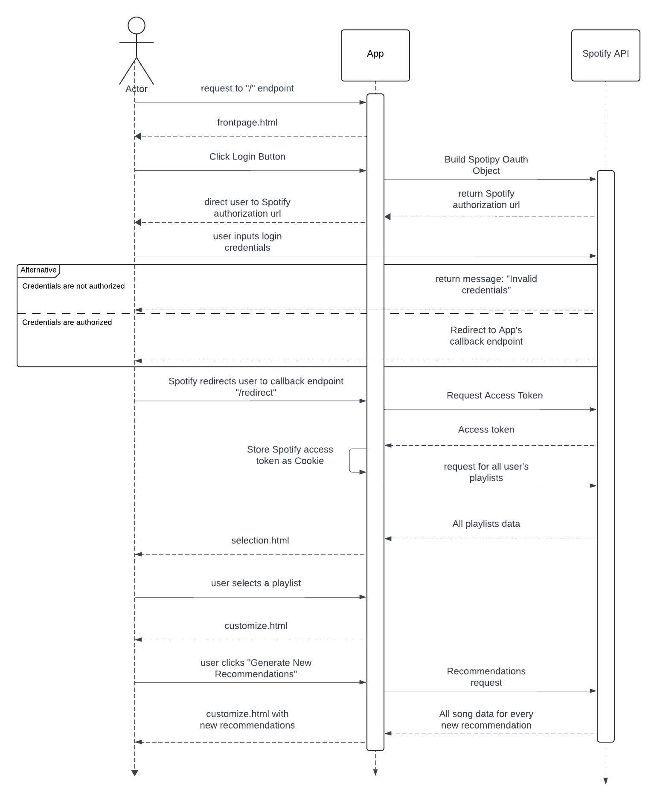

# Welcome to the Spotify Playlist Expander
This is tool allows the user to (1) generate recommendations based on the first five songs of an app, (2) add songs to the selected playlist, and (3) play recommended songs from the app. The popularity, instrumentalness, danceability, valence, and batch size of the recommended songs are customizable with user inputs.

# UML Sequence Diagram

# Installation

## Install dependencies

> pip install -r requirments.txt

## Configure environment variables

set ID to your Client ID from the [Spotify Developer Dashboard](https://developer.spotify.com/dashboard)

set KEY to your Client secret from the [Spotify Developer Dashboard](https://developer.spotify.com/dashboard)

set REDIRECT to your the redirect endpoint, http://localhost:5000/redirect if developing locally

set Redirect URI in the [Spotify Developer Dashboard](https://developer.spotify.com/dashboard) to your redirect endpoint

set FLASK_APP to app

## Run app

> flask run